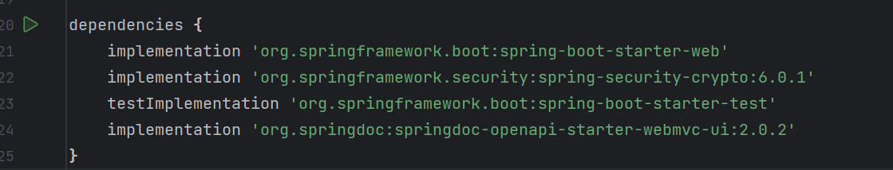
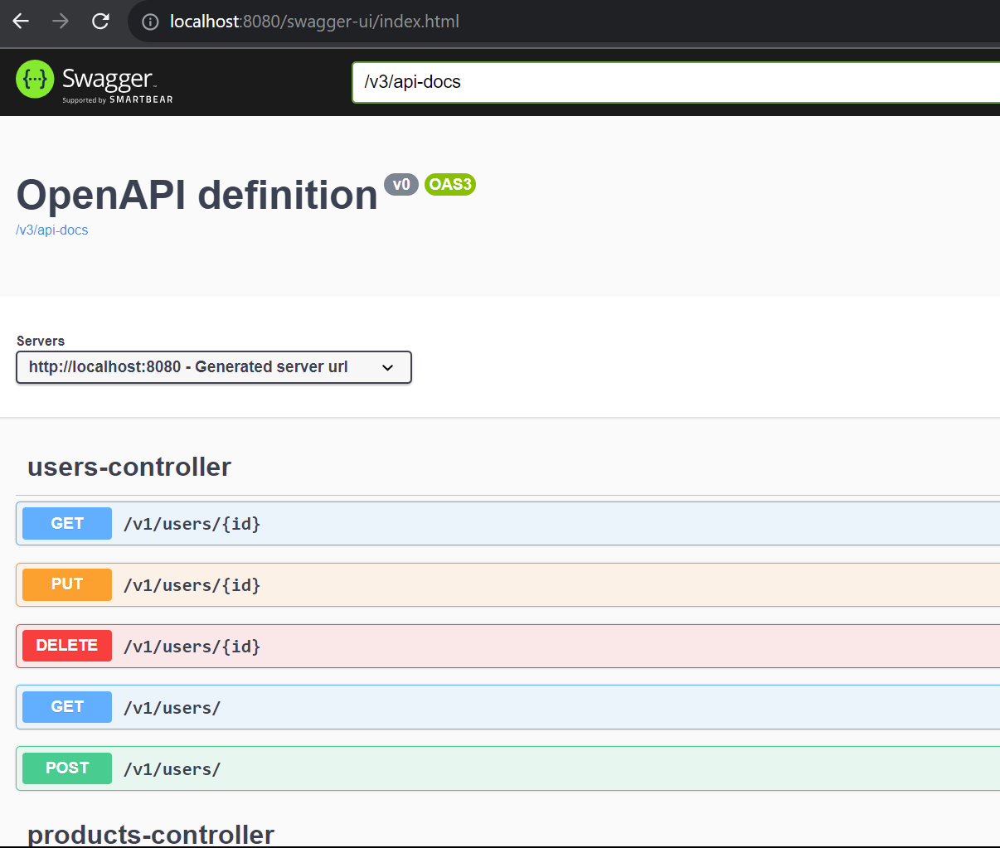
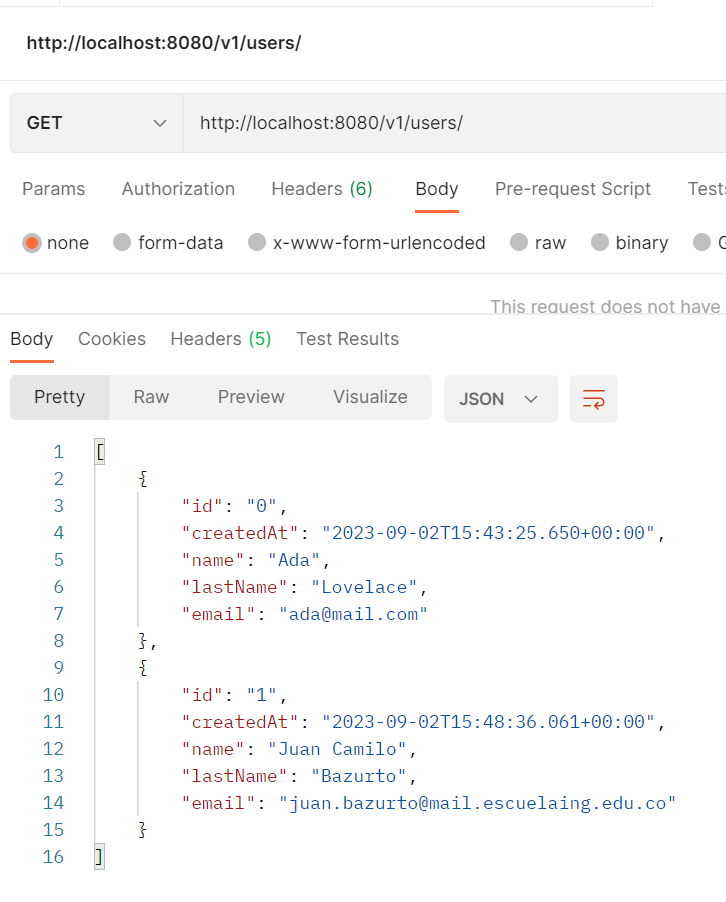
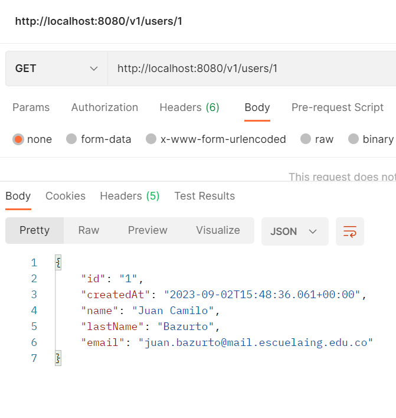
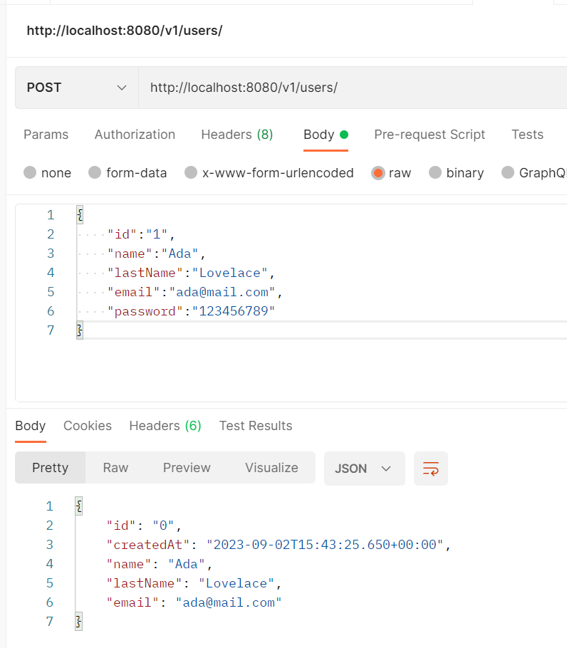
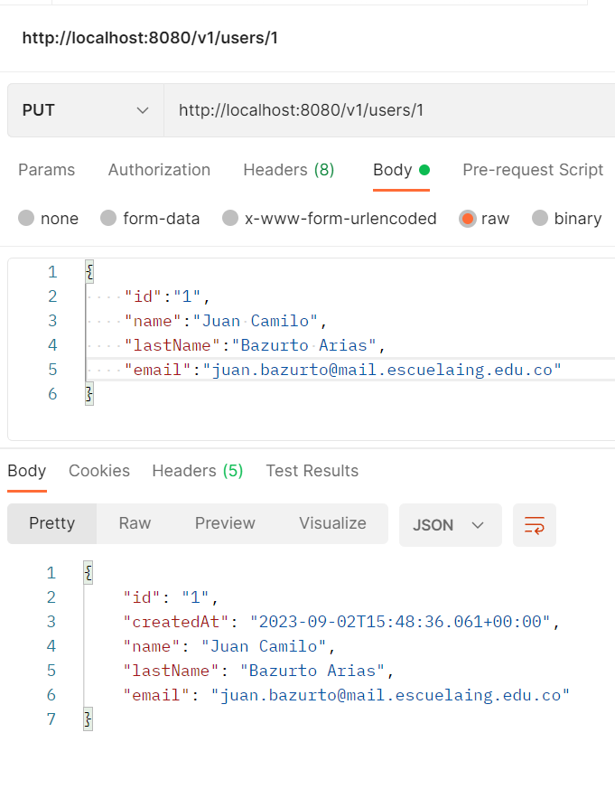
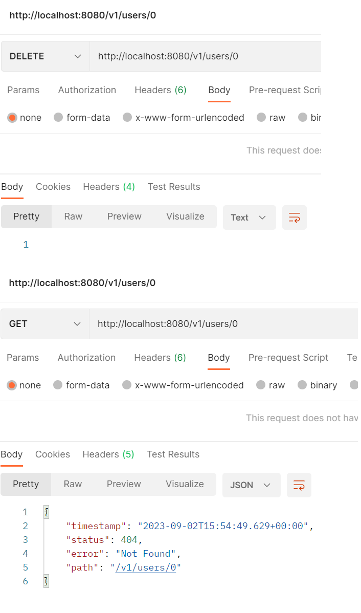

## Configurar Swagger en tu proyecto y generar la documentación de tu API REST

### Integra Swagger en el Codelab

- Agregamos la dependencia:
  
  

- Accedemos al endpoint de la documentacion de swagger en: http://localhost:8080/swagger-ui/index.html

## Postman

- GET

- POST

- PUT

- DELETE

## Authors

* **Juan Camilo Bazurto** - [Linkedin](https://www.linkedin.com/in/juan-camilo-b-b65379105/) - [GitHub](https://github.com/juan-bazurto-eci)